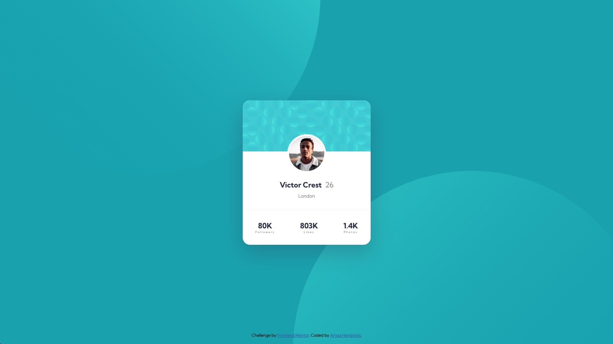

# Frontend Mentor - Profile card component solution

This is a solution to the [Profile card component challenge on Frontend Mentor](https://www.frontendmentor.io/challenges/profile-card-component-cfArpWshJ). Frontend Mentor challenges help you improve your coding skills by building realistic projects.

## Table of contents

- [Overview](#overview)
  - [The challenge](#the-challenge)
  - [Screenshot](#screenshot)
  - [Links](#links)
- [My process](#my-process)
  - [Built with](#built-with)
  - [What I learned](#what-i-learned)
  - [Continued development](#continued-development)
  - [Useful resources](#useful-resources)
- [Author](#author)
- [Acknowledgments](#acknowledgments)

**Note: Delete this note and update the table of contents based on what sections you keep.**

## Overview

### The challenge

- Build out the project to the designs provided

### Screenshot

### Links

- Solution URL: [Git Hub](https://github.com/ajohnson29/FM-Challenge-1)
- Live Site URL: [My Solution in Action](http://arissahendricks.com/samples/FM/)

## My process

My process was to review the image to see how I can divide the artwork within the container. Once I figured it out I started the layout within HTML and CSS.

### Built with

- Flexbox

### What I learned

I learned more about Flexbox and its capabilities.

## Author

- Website - [Arissa](https://www.arissahendricks.com)
- Frontend Mentor - [@ajohnson29](https://www.frontendmentor.io/profile/ajohnson29)
- Business - [Sunbrite Design, LLC](https://www.sunbritedesign.com/yourusername)
